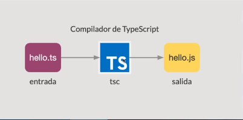
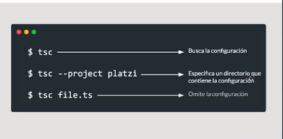
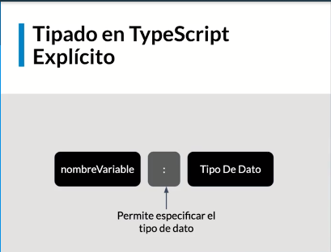
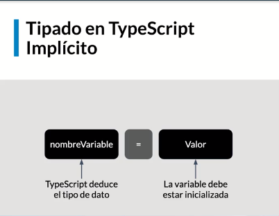
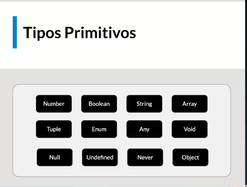

# Curso Typescript

<https://www.typescriptlang.org/>
<https://stackshare.io/typescript>
<https://www.typescriptlang.org/docs/handbook/typescript-from-scratch.html>

# ¿Que es?

Es un superconjunto tipado de javascript, que compila a javascript puede ser usado en cualquier navegador o host y adenas se traduce en un proyecto de codigo abierto.

**Lenguaje de programación tipado:** Provee un conjunto de tipos para poder usarlos con las variables, pudiendo personalizarlos o extenderlos.

**Lenguaje de alto nivel:** Entendible por humanos y posee un alto nivel de abstracción del código máquina.

**Genera como resultado código JavaScript:** Emite código javascript compatible con browsers y otras herramientas de javascript.

**Código abierto.**: Puedes visualizar el codigo fuente, estar al tanto de los issues y objetivos a corto y mediano plazo del proyecto.

# Porque usar TypeScript

- Programación orientada a objetos
- Potenciar tu código JavaScript (javascript con superpoderes)
- Mayor productividad
- Poderoso sistema de tipos
- Compila a ES5, ES6 y más
- Proyecto muy activo/Open source
- Actualizaciones periódicas
- Comunidad creciente
- Puede prevenir cerca del 15% de bugs
- Puede usar TypeScript para backend

# Comenzando

Con el siguiente comando lo instalaremos de manera global:

```
sudo npm install -g typescript
```

Consultar la versión del compilador de TS:

```
tsc -v
```

Compilar nuestros ficheros .ts

```
tsc your_file.ts
```

Compilar de manera ‘automática’ nuestros ficheros .ts

```
tsc --watch your_file.ts
```



# tsconfig.json

El archivo tsconfig. json es el que indica en un proyecto que se está trabajando con TypeScript. Lo colocas en la raíz de carpetas del proyecto y en él situamos un JSON con todas las configuraciones de trabajo para el transpilador de TypeScript.

Especifica la raiz de un proyecto TypeScript

Permite configurar opciones para el compilado



# Tipado

- Tipado Explicito: Define una sintaxis para la creación de variables con tipo de dato
  nomVariable : Tipo de dato



- Tipado Inferido: TypeScript tiene la habilidad de deducir el tipo en funcion de un valor.



# Tipo de datos primitivos



## Number

Numericos, hexadecimales, binarios, octales.

```

//--------- Number ------------
// Explicito
let phone: number
phone = 1
phone = 3023455882
// phone = 'hola' // Error

// Inferido
let phoneNumber = 3023455882
phoneNumber = 123
// phoneNumber = true // Error de tipo

let hex: number = 0xf00d
let binary: number = 0b1010
let octal: number = 0o744
```

## Boolean

```
//---------- Bolean ----------
// Tipado Explicito
let isPro: boolean
isPro = true
isPro = false
// isPro = 1 // Error

// Inferido
let isUserPro = false
isUserPro = true
```

## String

Podemos hacer uso de comillas dobles o simples .

```
//------------ String ------------
// Explicito
let username: string = 'luixaviles'
username = 'Juan'
// username = true // Error

// Template String
// Uso de back-tick `
let userInfo: string
userInfo = `
  User Info:
  username: ${username}
  firstName: ${username} Gonzalez
  phone: ${phone}
  isPro: ${isPro}
```

## Any

Usado para capturar valores dinámicos
Los valores pueren cambiar de tipo en el tiempo, Ej:

- APIs externas
- Librerías de terceros

```
// type Any --> For dynamic variables
// Explicit type
let idUser: any;
idUser = 1; // Number
idUser = '1'; // String
console.log('iduser ', idUser);
console.log(typeof idUser);

// Inferred type
let otherId;
otherId = '1';
otherId = 1;
// otherId = true;
console.log('otherId ', otherId);
console.log(typeof otherId);

let suprise: any = 'Hello typescript';
// suprise.sayHello(); // Error
const res = suprise.substring(10);
console.log(`res ${res}`);
```

## Void

Lo opuesto a any, representa la ausencia de tipo. usado en funciones que no retornan nada.

```
/ type void for functions
// Explicit type

function showInfo(user: any): any {
  console.log(`User Info ${user.id} ${user.username} ${user.firstname}`);
  //   return 'hola';
}

showInfo({id: 1, username: 'Antúnez Durán', firstname: 'Francisco Javier'});

// Inferred type
function showFormattedInfo(user: any) {
  console.log(`User Info,
        id: ${user.id}
        username: ${user.username}
        firstname: ${user.firstname}`);
}

showFormattedInfo({id: 1, username: 'Antúnez Durán', firstname: 'Francisco Javier'});

// Type void as variable data type
let unusable: void;
// unusable = null; --> colocar "strict": false en tsconfig.json para poder hacer uso
unusable = undefined;
```

## Never

Es un tipo de dato especial en TypeScript, representa el tipo de valor que nunca ocurre, puede ser usado en funciones que lanzan excepciones o en funciones que nunca retornan un valor.

```
// Type never
function handleError(code: number, message: string): never {
  // Process your code
  // Generate a message
  throw new Error(`${message}. Code: ${code}`);
}

try {
  console.log('La funcion handleError no devuelve nada bajo esta linea');
  handleError(404, 'Not found');
} catch (error) {}

function sumNumbers(limit: number): never {
  let sum = 0;
  while (true) {
    sum++;
  }
  // return sum;
}

sumNumbers(10); // --> Llamada a un bucle infinito no acabaria nunca, typescript no compila, al verlo.

```

## NULL

```
//  ------------------ NULL ------------------
// Explicita
let nullVariable: null;
nullVariable = null;
// nullVariable = 1; // --> Error

// Inferido
let otherVariable = null;   // --> any
otherVariable = 'test';

console.log('nullVariable : ', nullVariable);
console.log('otherVariable : ', otherVariable);

```

## UNDEFINED

```
//  ----------------- UNDEFINED -----------------
let undefinedVariable: undefined = undefined;
// undefinedVariable = 'test'; // --> Error

let otherUndefined = undefined;     // --> any
otherUndefined = 1;

console.log('undefinedVariable : ', undefinedVariable);
console.log('otherUndefined : ', otherUndefined);

```

NULL y UNDEFINED tambien se pueden definir como como subtipos. En el archivo .conf de typescript podemos ver el Flag del compilador de typescript --strictNullChecks. Solo permite asignar null y undefined a una variable de tipo any o sus tipos respectivos.

```
let albumName: string;
// albumName = null;
// albumName = undefined;
```

Buena práctica:
Tratar de evitar null y undefined en los projectos.

## object

Es el tipo de dato que representa un valor no primitivo ( que no sea number, boolean, string etc...)

OJO!

- **Object:** instancia de la clase Object de Javascript
- **object:** tipo para valores no primitivos. Con este tipo no se puede acceder a las propiedades del objeto. (user.id)

```

// ------ Tipo: object ------
// explicito
let user: object;
user = {}; // Object
user = {
    id: 1,
    username: 'paparazzi',
    firstname: 'Pablo',
    isPro: true
};
console.log('user', user);
// console.log('user.username', user.username); // --> no se puede acceder al dato username

/*
 * Object: instancia de la clase Object de JavaScript
 * object: tipo para valores no primitivos
 */

// ---- Object vs object (Clase JS vs tipo TS) ----
// considera como tipo instancia Object de JavaScript
const myObj = {
    id: 1,
    username: 'paparazzi',
    firstname: 'Pablo',
    isPro: true
};
const isInstance = myObj instanceof Object; // trueo o false
console.log('isInstance : ', isInstance); // clase Object JavaScript
console.log('myObj.username : ', myObj.username); // --> se puede acceder al dato username

```

## Array

Un Array es un tipo especial de tipo de datos que puede almacenar múltiples valores de diferentes tipos de datos secuencialmente usando una sintaxis especial.
TypeScript admite matrices, similar a JavaScript. Hay dos formas de declarar una Array :

Utilizando corchetes. Este método es similar a cómo declararía matrices en JavaScript.

```
const names = string[];
```

Usando un tipo de arreglo genérico, Array <elementType>.

```
const months = Array<string>;
```

Ambos métodos producen el mismo resultado.

```

/ ------- Tipo: Array -------

// Explicito
let users: string[];
users = ['luixaviles', 'paparazzi', 'lensqueen'];
// users = [1, true, 'test']; // --> Error

// Inferido
let otherUsers = ['luixaviles', 'paparazzi', 'lensqueen'];
// otherUsers = [1, true, 'test']; // --> Error

// Array<tipoDato>
let pictureTitles: Array<string>;
pictureTitles = ['Favorite Sunset', 'Vacation Time', 'Landscape'];

// Accediendo a los valores en un Array
console.log('first user : ', users[0]); // --> users[indice]: luixaviles
console.log('first title : ', pictureTitles[0]);

// Propiedades en Array
console.log('users.length : ', users.length); // -> Tamaño del Array

// Uso de funciones en Arrays
users.push('aPlatziUser');  // -> agrega dato a la cola del Array
users.sort();   // --> ordena el Array de menor a mayor (alfabetica)
console.log('users', users);

```

## Tupla

Una tupla en TypeScript es un array de elementos que están tipados. De esta manera cada vez que haya que insertar un elemento se validará que dicho elemento coincida con el tipo de dato establecido en la tupla. Y contiene un numero fijo de elementos.

```

export {}; // -> user ya fue declarado en otro archivo

// [1, 'user']
let user: [number, string]; // -> user ya fue declarado en otro archivo
user = [1, 'luixaviles'];

console.log('user : ', user);
console.log('username : ', user[1]);
console.log('username.length : ', user[1].length);
console.log('id : ', user[0]);

// Tuplas con varios valores
// id, username, isPro
let userInfo: [number, string, boolean];
userInfo = [2, 'paparazzi', true];
console.log('userInfo : ', userInfo);

// Arreglo de Tuplas
let array: [number, string][] = [];
array.push([1, 'luixaviles']);
array.push([2, 'paparazzi']);
array.push([3, 'lensQueen']);   // indice: 2
console.log('array : ', array);

// Uso de funciones array
// lensQueen --> lensQueen001
array[2][1] = array[2][1].concat('001');  // --> concatena
console.log('array : ', array);

```

## Enum

Los enum se podria decir que son una lista de valores. Las variables que tengan definido como tipo un enum solo podran asignarsele valores que esten dentro del enum.

```

/*
const landscape = 0;
const portrait = 1;
const square = 2;
const panorama = 3;

*/
// crear
enum PhotoOrientation {
	Landscape,
	Portrait,
	Square,
	Panorama
}
// utilizar
const landscape: PhotoOrientation = PhotoOrientation.Landscape;

console.log('landscape : ', landscape); // -> 0
console.log('Landscape : ', PhotoOrientation[0]); // -> Landscape


enum Country {
    Bolivia = 'bol',
    Colombia = 'col',
    Mexico = 'mex',
    EEUU = 'usa',
    España = 'esp'
}
const country: Country = Country.Colombia;
console.log('country : ', country); // --> col
```

# Union Types

En TypeScript se puede definir una variable con multiple tipos de datos: Union Type.
Se usa el simbolo de pipe ('|') entre los tipos

```
export {}

// 10, '10'
let idUser: number | string;
idUser = 10;
idUser = '10';
// Buscar username dado un ID
function getUsernameById(id: number | string) {
    // logica de negocio, find the user
    return 'luixaviles';
}
getUsernameById(20);
getUsernameById('20');

/* Alias de Tipos: El alias se puede aplicar tambien a un conjunto o combinacion de tipos */
// alias de tipos: TS
type IdUser = number | string;
type Username = string;
let idUser: IdUser;
idUser = 10;
idUser = '10';

// Buscar username dado un ID
// function getUsernameById(id: number | string)
function getUsernameById(id: IdUser): Username {
    // logica de negocio, find the user
    return 'luixaviles';
}
getUsernameById(20);
getUsernameById('20');

```

Tipos literales

```
/* Tipos literales */
// 100x100, 500x500, 1000x1000
type SquareSize = '100x100' | '500x500' | '1000x1000';   // string | number
// let smallPicture: SquareSize = '200x200'; // --> Error
let smallPicture: SquareSize = '100x100';
let mediumPicture: SquareSize = '500x500';
```

# Aserciones de tipos

Mecanismo de conversión de tipos de datos. Se parece al casting de tipos en otros lenguajes de programación sin embargo no es lo mismo ya que en la asercion de tipos ts no realiza ningun tipo de verificacion. Es una manera de decirle al compilador "Tranquilo, se lo que estoy haciendo."

Se utiliza mas la sintaxys "angle brakets" que al sitaxis "as"

```
export {};

//<type> // Angle Bracket syntax
let username: any;
username = 'anbreaker';

// Tenemos un string, Complidor de TS confia en mí:
let message: string =
  (<string>username).length > 5 ? `Welcome ${username}` : `username is too short`;
console.log('Message ->', message);

let usernameWithId: any = 'anbreakera 1415';
// Como obtener el username?

usernameWithId = (<string>usernameWithId).substring(0, 9);
console.log('username only', usernameWithId);

// Sintaxis 'as'
usernameWithId =
  (username as string).length > 5 ? `Welcome ${username}` : `username is too short`;
console.log('username ->', username);

let helloUser: any;
helloUser = 'Hello Coder';
username = (helloUser as string).substring(6);
console.log('username', username);
```

# Funciones en Typescript

- Los parametros de las funcione son tipados
- Se pueden definir parametros opcionales
- El tipo de retorno puede ser un tipo basico/primitivo o una combinacion de ellos.

```

// // Crear una Fotografia: JS
// function createPicture(title, date, size) {
//     // title
// }

type SquareSize = '100x100' | '500x500' | '1000x1000'
// Usamos TS, definimos tipos para paramentros
function createPicture(title:string, date: string, size: SquareSize) {
    // Se crea la fotografia
    console.log('create Picture using', title, date, size);
}

createPicture('My Birthday', '2020-03-10', '500x500');
createPicture('Colombia', '2020-03-20'); // --> Error

// Parametros opcionales
function createPictureOptional(title?:string, date?: string, size?: SquareSize) {
    // Se crea la fotografia
    console.log('create Picture using', title, date, size);
}

// Flat Array Function
let createPic = (title: string, date: string, size: SquareSize): object => {
    // return {
    //     title: title,
    //     date: date,
    //     size: size
    // };
    return { title, date, size };
};

const picture = createPic('Platzi session', '2020-03-10', '100x100');
console.log(picture);

```

# Tipos de Retorno

Usar never cuando vamos a lanzar excepciones en la función.
Al momento de usar la función, ponerlo en un try catch.

```

//Tipo de retorno en TypeScript

function handleError(code: number, message: string): never | string {
  // Procesamineto
  if (message === 'error') {
    throw new Error(`${message}. Code error: ${code}`);
  } else {
    return 'An error has ocurred';
  }
}

let result = handleError(200, 'OK'); // Devuelve un string
console.log('result', result);

try {
  result = handleError(404, 'error'); // Devuelve un error que debemos capturar.
  console.log('result', result);
} catch (error) {
  console.log('Se produjo un error y lo capturamos');
}
```

# Interfaces

<https://www.typescriptlang.org/docs/handbook/interfaces.html>

Las interfaces una forma poderosa de definir 'contratos' tanto para tu proyecto, como para el codigo externo.

Una interfaz es como un molde para un objeto. Si el objeto no encaja en el molde, te va a dar error.

```

// Funcion para mostrar una Fotografia
export {}

enum PhotoOrientation {
    Landscape,
    Portrait,
    Square,
    Panorama
}
interface Picture {
    title: string,
    date: string,
    orientation: PhotoOrientation
}
function showPicture(picture: Picture) {
    console.log(`[title: ${picture.title}, date: ${picture.date}, orientation: ${picture.orientation}]`);
}
let myPic = {
    title: 'Test title',
    date: '2020-03',
    orientation: PhotoOrientation.Landscape
}
showPicture(myPic);
showPicture({
    title: 'Test Title',
    date: '2020-03',
    orientation: PhotoOrientation.Portrait,
    // extra: 'test'   // --> Error
}); // objecto anonimo


```

- Propiedades opcionales
  No todas las propiedades de una interfaz podrian ser requeridas. Usamos el simbolo ‘?’ luego del nombre de la propiedad.

```

interface PictureConfig {
    title?: string;
    date?: string;
    orientation?: PhotoOrientation
}
function generatePicture(config: PictureConfig) {
    const pic = { title: 'Default', date: '2020-03' };
    if (config.title) {
        pic.title = config.title;
    }
    if (config.date) {
        pic.date = config.date;
    }
    return pic;
}
let picture = generatePicture({});
console.log('picture : ', picture);
picture = generatePicture({title: 'Travel Pic'});
console.log('picture : ', picture);
picture = generatePicture({title: 'Travel Pic', date: '2012-05'});
console.log('picture : ', picture);


```

- Propiedades de solo lectura:

Algunas propiedades de la interfaz podrian no ser modificables una vez creado el objeto. Esto es posible usando readonly antes del nombre de la propiedad

```
// Interfaz: usuario
interface User {
    readonly id: number; // solo lectura
    username: string;
    isPro: boolean
}
let user: User;
user = { id: 10, username: 'luixaviles', isPro: true }
console.log('user : ', user);
user.username = 'paparazzi';
// user.id = 20; // --> Error
console.log('user : ', user);

```
